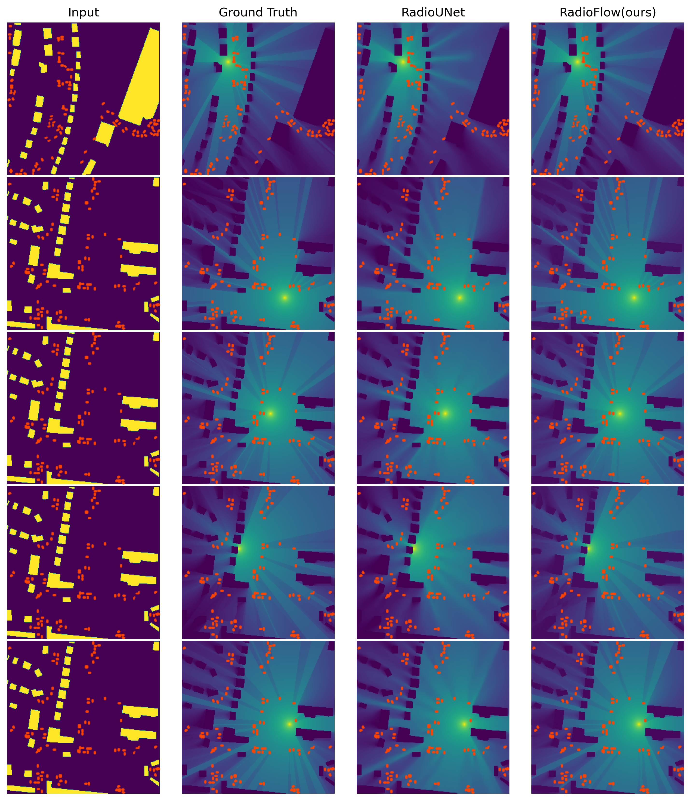
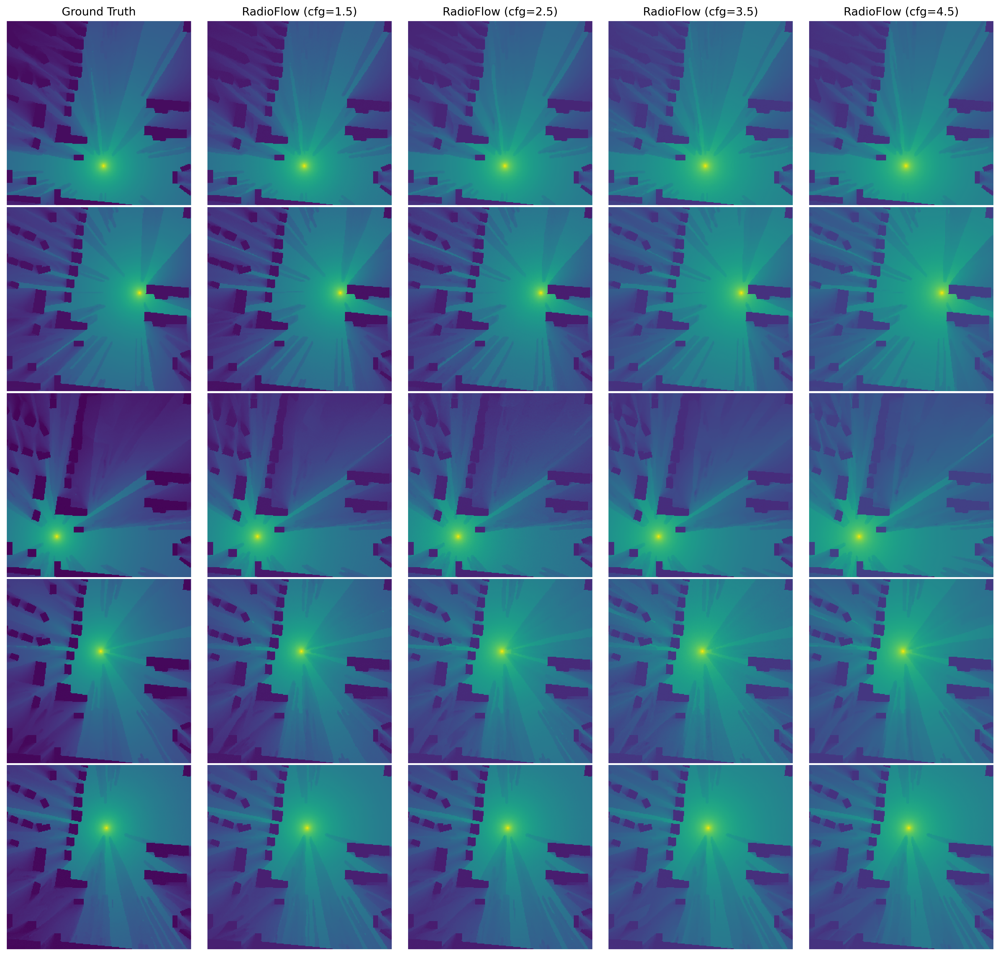
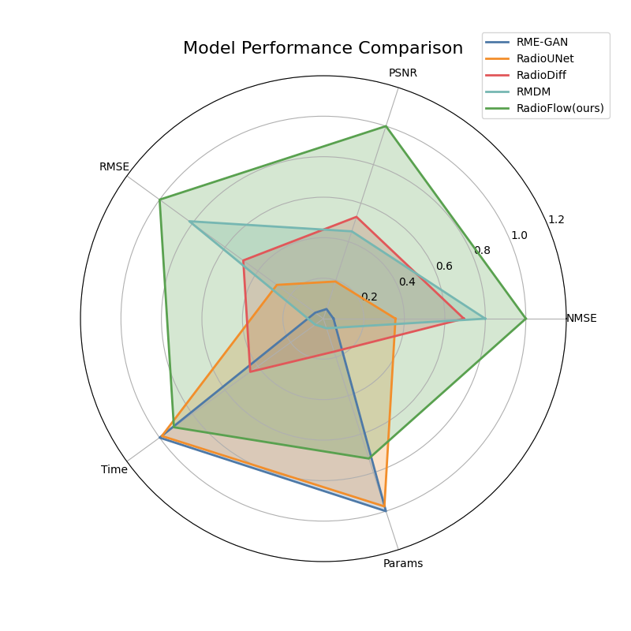

# RadioFlow 🚀📡  
*Flow‑Matching for Lightning‑Fast, High‑Fidelity Radio‑Map Generation*

  
  
  

---
## ✨ Why RadioFlow?

RadioFlow is a lightweight, ultra-fast generative model tailored for high-fidelity radio map construction. Compared to existing baselines like diffusion-based and UNet-based methods, it delivers significantly better visual quality, drastically reduced inference time, and an exceptionally compact model size—especially with the edge-friendly **RadioFlow-Lite** variant. Powered by **Conditional Flow Matching**, **spatial attention UNet**, and **classifier-free guidance**, it achieves state-of-the-art performance with a single-step ODE solver, completely bypassing the costly iterative denoising used in diffusion models.

The framework features a modular design with:
- 🧱 Flexible UNet-based architecture and attention modules  
- 🧠 A training pipeline supporting mixed precision, EMA, and real-time visualization  
- ⚙️ RadioFlow can be seamlessly scaled down to a lightweight version for edge and embedded devices

▶️ **[Download Pretrained Checkpoints (BaiduNetDisk)](https://pan.baidu.com/s/1uuIglmtNukc6_RjFsE7Z_w?pwd=n8f4)**

> *From noise to signal map in just one deterministic step.* 🚀
---

## 🚀 Quick Start

## 📝 Reproducing Paper Results

| 🧪 Task | 📉 NMSE ↓ | 🔊 PSNR ↑ | 📏 RMSE ↓ | 🧠 SSIM ↑ |
|--------|-----------|-----------|-----------|------------|
| **SRM** | **0.0023** | **39.83 dB** | **0.0103** | **0.9249** |
| **DRM** | **0.0028** | **39.37 dB** | **0.0108** | **0.9236** |

## 📊 Visual Gallery
| DRM Flow (ours) vs RadioUNet | SRM Flow (ours) vs RadioUNet |
|:----------------------------:|:----------------------------:|
|  |  |
| *Fig. 1: DRM Flow comparison* | *Fig. 2: SRM Flow comparison* |

| DRM Task: CFG Scale Comparison                                          | SRM Task: CFG Scale Comparison                                          |
|:------:|:-------:|
|        |        |
| *Fig. 3: DRM map outputs under different CFG scale settings*            | *Fig. 4: SRM map outputs under different CFG scale settings*            |

*Fig. 5: Quantitative comparison of NMSE, PSNR, RMSE, Time,and Params for RadioFlow against other methods.*  
