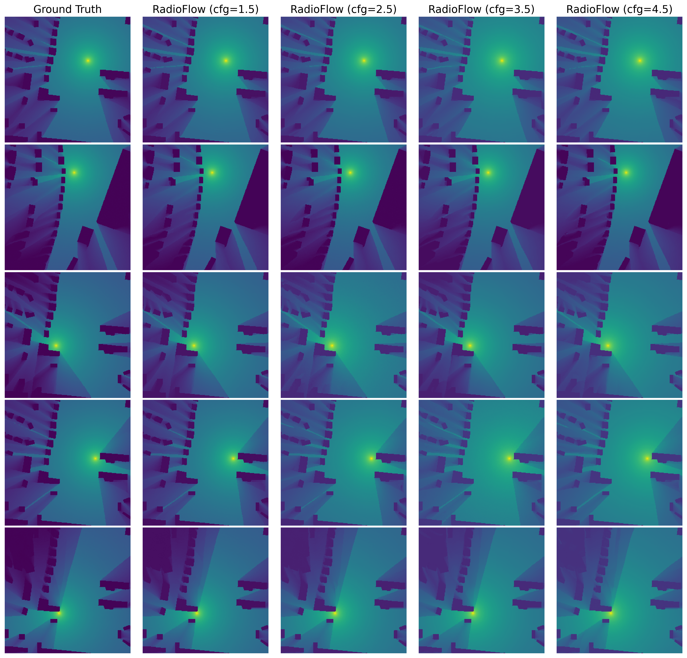

# RadioFlow 🚀📡  
*Flow‑Matching for Lightning‑Fast, High‑Fidelity Radio‑Map Generation*


<p align="center">
  
  
  
</p>

---
## ✨ Why RadioFlow?

RadioFlow is a lightweight, ultra-fast generative model tailored for high-fidelity radio map construction. Compared to existing baselines like diffusion-based and UNet-based methods, it delivers significantly better visual quality, drastically reduced inference time, and an exceptionally compact model size—especially with the edge-friendly **RadioFlow-Lite** variant. Powered by **Conditional Flow Matching**, **spatial attention UNet**, and **classifier-free guidance**, it achieves state-of-the-art performance with a single-step ODE solver, completely bypassing the costly iterative denoising used in diffusion models.

The framework features a modular design with:
- 🧱 Flexible UNet-based architecture and attention modules  
- 🧠 A training pipeline supporting mixed precision, EMA, and real-time visualization  
- ⚙️ RadioFlow can be seamlessly scaled down to a lightweight version for edge and embedded devices

▶️ **[Download Pretrained Checkpoints (BaiduNetDisk)](https://pan.baidu.com/s/1uuIglmtNukc6_RjFsE7Z_w?pwd=n8f4)**

> *From noise to signal map in just one deterministic step.* 🚀
---
## 🚀 Quick Start

### 1. Dataset

- **RadioMapSeer**  
  [Download link](https://radiomapseer.github.io/)

- **RadioMap3DSeer**  
  [Download link](https://drive.google.com/file/d/1YW3RyM9KYBe110CXC5aZJJ0MAIti65bY/view)

### 2. Training

1. Open `config.py` and set:
   - `data_dir`: path to your dataset
   - training hyperparameters (e.g., learning rate, batch size, number of epochs)
2. Choose the appropriate data loader:
   - `RadioUNet_c` for the RadioMapSeer dataset  
   - `RadioMap3Dset` for the RadioMap3DSeer dataset
3. Launch training:
   ```bash
   python train.py
   ```

### 3. Testing

- **DRM evaluation:**
  ```bash
  python test.py --task drm
  ```
- **SRM evaluation:**
  ```bash
  python test.py --task srm
  ```

### 4. Visualization

1. In `config.py`, configure the `VizConfig` class to specify visualization options.
2. Run the visualization script:
   ```bash
   python viz.py
   ```
## 📝 Reproducing Paper Results

| 🧪 Task | 📦 Dataset        | 📉 NMSE ↓  | 🔊 PSNR ↑   | 📏 RMSE ↓  | 🧠 SSIM ↑  |
|--------|-------------------|------------|-------------|------------|------------|
| **SRM** | RadioMapSeer      | **0.0023** | **39.83 dB** | **0.0103** | **0.9249** |
| **DRM** | RadioMapSeer      | **0.0028** | **39.37 dB** | **0.0108** | **0.9236** |
| **SRM** | RadioMap3DSeer    | **0.0496** | **26.87 dB** | **0.0458** | **0.7377** |


## 📊 Visual Gallery
| DRM Flow (ours) vs RadioUNet | SRM Flow (ours) vs RadioUNet |
|:----------------------------:|:----------------------------:|
|  |  |
| *Fig. 1: DRM Flow comparison* | *Fig. 2: SRM Flow comparison* |

| DRM Task: CFG Scale Comparison                                          | SRM Task: CFG Scale Comparison                                          |
|:------:|:-------:|
|        |        |
| *Fig. 3: DRM map outputs under different CFG scale settings*            | *Fig. 4: SRM map outputs under different CFG scale settings*            |


*Fig. 5: Quantitative comparison of NMSE, PSNR, RMSE, Time,and Params for RadioFlow against other methods.*  
